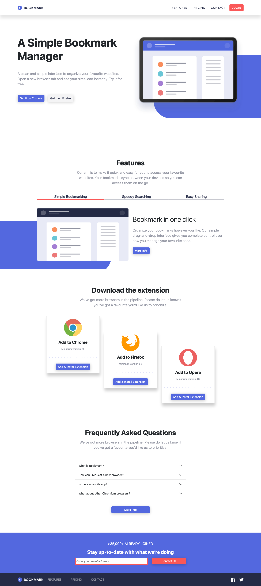
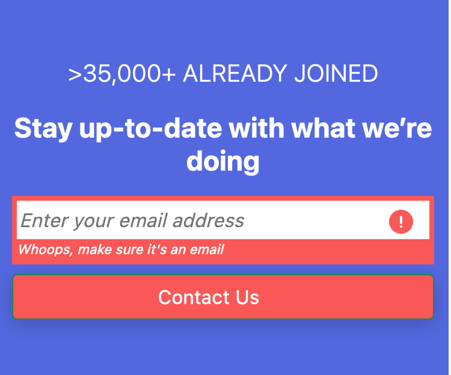
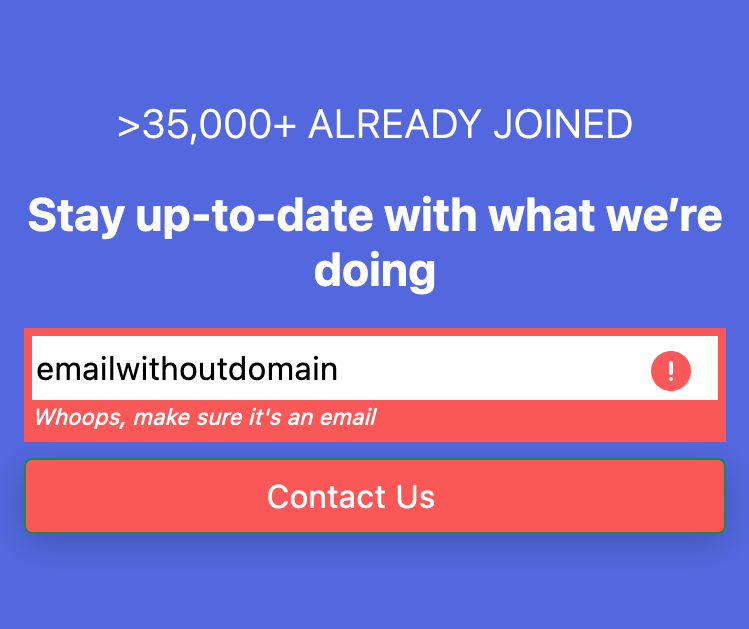

# Frontend Mentor - Bookmark landing page solution

This is a solution to the [Bookmark landing page challenge on Frontend Mentor](https://www.frontendmentor.io/challenges/bookmark-landing-page-5d0b588a9edda32581d29158). Frontend Mentor challenges help you improve your coding skills by building realistic projects. 

## Table of contents

- [Overview](#overview)
  - [The challenge](#the-challenge)
  - [Screenshot](#screenshot)
  - [Links](#links)
- [My process](#my-process)
  - [Built with](#built-with)
  - [Why I took this challenge](#why-I-took-this-challenge)
- [Author](#author)

## Overview

### The challenge

Users should be able to:

- View the optimal layout for the site depending on their device's screen size
- See hover states for all interactive elements on the page
- Receive an error message when the newsletter form is submitted if:
  - The input field is empty
  - The email address is not formatted correctly

### Screenshot

#### Desktop view

#### Mobile view

#### Mobile view with navigation open

#### Error message for invalid input

### Links

- Solution URL: [https://github.com/frankiecflam/bookmark-landing-page](https://github.com/frankiecflam/bookmark-landing-page)
- Live Site URL: [https://frankie-bookmark.netlify.app/](https://frankie-bookmark.netlify.app/)

## My process

### Built with

- Semantic HTML5 markup
- Bootstrap 5 with custom variables
- SASS
- Mobile-first workflow

### Why I took this challenge
This is a coding challenge from Frontend mentor. The main purpose of coding this website is to practise my newly-learned Bootstrap 5 skills.

## Author
- Email - [Frankie Lam](cfl.frankie@gmail.com)
- Instagram - [@frankie___lam](https://www.instagram.com/frankie___lam)
- Facebook - [@Frankie Lam](https://www.facebook.com/frankiecflam)